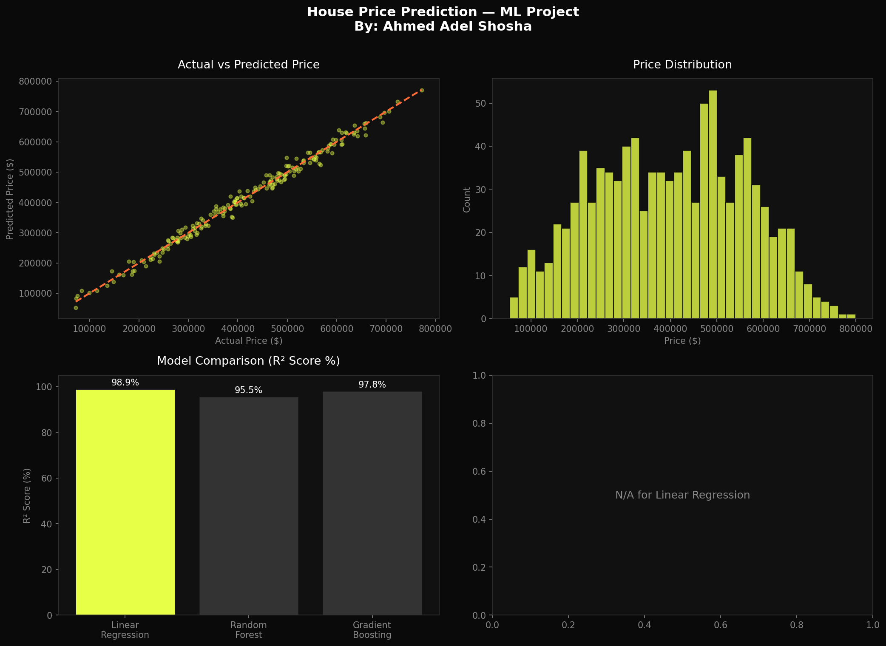

<div align="center">

# 🏠 House Price Prediction
### Machine Learning Project


<br>

> **Predicting house prices using Machine Learning with 98.9% accuracy**  
> Comparing 3 ML models — Linear Regression, Random Forest, Gradient Boosting

**[Ahmed Adel Shosha](https://ahmed-a-shosha.github.io)** — AI Engineer & ML Specialist

</div>

---

## 📊 Results Preview



---

## 🧠 About The Project

This project builds a complete **end-to-end Machine Learning pipeline** to predict house prices based on real-world-like features.

The workflow covers:

```
Raw Data → EDA → Feature Engineering → Model Training → Evaluation → Prediction
```

**3 models** were trained and compared to find the best performer:

| 🥇 | Model | R² Score | MAE | RMSE |
|----|-------|----------|-----|------|
| 🏆 | **Linear Regression** | **98.9%** | $12,604 | $15,788 |
| 🥈 | Gradient Boosting | 97.8% | $17,415 | $22,057 |
| 🥉 | Random Forest | 95.5% | $25,841 | $31,857 |

---

## ⚙️ Features Used

```python
features = [
    'area_sqft',        # Total area in square feet
    'bedrooms',         # Number of bedrooms
    'bathrooms',        # Number of bathrooms
    'age_years',        # Age of the house
    'distance_center',  # Distance from city center (km)
    'has_garage',       # Garage availability (0/1)
    'has_pool',         # Pool availability (0/1)
    'floor_number',     # Floor number
    'neighborhood',     # Premium / Standard / Budget
    'rooms_total',      # ✨ Engineered feature
    'is_new',           # ✨ Engineered feature (age < 5 years)
]
```

---

## 🚀 Quick Start

### ▶️ Run on Google Colab (No Setup Needed)
[](https://colab.research.google.com/)

1. Open [Google Colab](https://colab.research.google.com)
2. Upload `house_price.py`
3. Run all — done!

### 💻 Run Locally
```bash
# Clone the repo
git clone https://github.com/Ahmed-A-Shosha/house-price-prediction.git
cd house-price-prediction

# Install dependencies
pip install pandas numpy scikit-learn matplotlib seaborn

# Run
python house_price.py
```

---

## 📁 Project Structure

```
house-price-prediction/
│
├── 🐍 house_price.py           → Full ML pipeline
├── 📊 house_price_results.png  → Visualizations & charts
└── 📖 README.md                → Documentation
```

---

## 📈 What's Inside The Code

```
✅ Data Generation (995 houses, 11 features)
✅ Exploratory Data Analysis (EDA)
✅ Feature Engineering (2 new features)
✅ Train/Test Split (80/20)
✅ StandardScaler normalization
✅ 3 Model Training & Comparison
✅ Visualization (4 charts)
✅ Real-time Prediction on new house
```

---

## 🔮 Sample Prediction

```python
# Input
new_house = {
    'area_sqft': 1800,
    'bedrooms': 3,
    'bathrooms': 2,
    'age_years': 5,
    'distance_center': 8.0,
    'has_garage': True,
    'neighborhood': 'Standard'
}

# Output
Predicted Price: $301,778 💰
```

---

<div align="center">

## 👤 Author

**Ahmed Adel Shosha**  
AI Engineer · ML Specialist · Team Leader

[](https://ahmed-a-shosha.github.io)
[](https://linkedin.com/in/ahmedadelshosha)
[](https://github.com/Ahmed-A-Shosha)

---

⭐ **If you found this project useful, please give it a star!** ⭐

</div>
